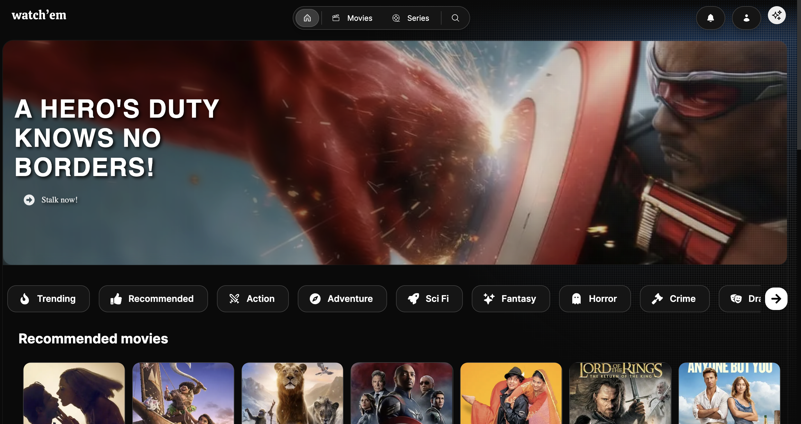

# Watch'em 

Watch'em is a full-stack movie recommendation and playlist management web app that allows users to discover, organize, and share their favorite movies effortlessly. With user authentication, personalized movie playlists, ratings, and streaming availability, Watch'em enhances the movie-watching experience.

## Features 🚀

- User Authentication & Profiles: Secure signup/login with personal profiles to track playlists, ratings, and reviews.
- Movie Playlists: Create, manage, and share custom movie playlists.
- Advanced Search & Filtering: Search by title, genre, or actor with genre-based filtering.
- Streaming Availability: Fetch streaming platform info (Netflix, Prime, Disney+, etc.) via JustWatch/Reelgood API.
- Ratings & Reviews: Rate movies, write reviews, and view aggregated ratings.
- Movie Recommendations: Get personalized movie suggestions using TMDb/OMDb APIs.
- User Dashboard: Track playlists, ratings, and trending movies.
- Social Sharing: Share playlists with friends and follow other users.

## Tech Stack

- Frontend: ReactJs, NextJs, [Once UI](#once-ui)

- Backend: Java + Spring Boot (REST APIs), MongoDB, JWT Authentication.
- APIs: TMDb, JustWatch/Reelgood, OMDB for movie data and streaming availability.
- Deployment: React (Vercel/Netlify), Spring Boot (AWS/Heroku), MongoDB Atlas.

###  Once UI

Start building your Next.js app in minutes with: 
* **A robust token and style system** that simplifies customization and ensures consistency. 
* **A copy-and-paste component library** that integrates seamlessly into your project.
* **Interactive documentation** to apply your branding and set component properties.

    ### Demo
    [demo.once-ui.com](https://demo.once-ui.com)

    

    ### Documentation
    [once-ui.com/docs](https://once-ui.com/docs)
